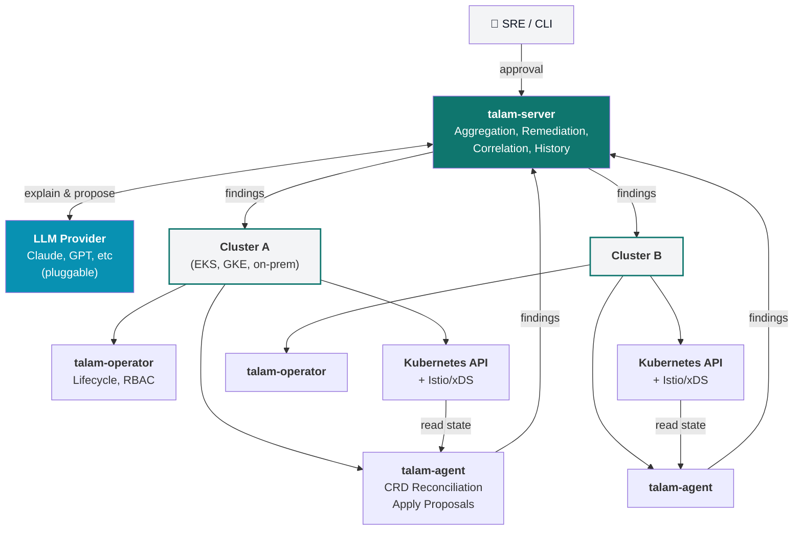

# Architecture overview

**Related:** reads [`0001`](../decisions/0001-server-agent-operator-split.md), [`0002`](../decisions/0002-deterministic-analyzers-then-llm.md), [`0003`](../decisions/0003-human-in-the-loop-remediation.md), [`0004`](../decisions/0004-mesh-agnostic-analyzer-interface.md); links out to every node under [`../components/`](../components/) and [`../concepts/`](../concepts/)

talam reads Kubernetes and Istio API objects, runs deterministic analyzers against them, and hands the results to an LLM to explain in plain English — the same loop k8sgpt runs one layer down the stack. talam's failures live one layer up: not "pod won't schedule" but "pod is healthy, mesh routing is not."

## Design principles

1. **Deterministic first.** Every finding starts as a rule-based check against real API/xDS state ([ADR-0002](../decisions/0002-deterministic-analyzers-then-llm.md)). The LLM explains and proposes — it never originates a diagnosis.
2. **No blind writes.** talam never mutates cluster state without explicit human approval ([ADR-0003](../decisions/0003-human-in-the-loop-remediation.md)).
3. **Fleet-native.** One server, many clusters, many agents ([ADR-0001](../decisions/0001-server-agent-operator-split.md)). A mesh boundary spanning clusters is a first-class case.
4. **Mesh-agnostic core.** The analyzer interface doesn't know Istio exists ([ADR-0004](../decisions/0004-mesh-agnostic-analyzer-interface.md)).

## System topology

Each mesh-bearing cluster runs one [operator](../components/operator/README.md) and one [agent](../components/agent/README.md). Agents report structured [findings](../concepts/finding-and-incident.md) to a central [talam-server](../components/server/README.md), the only component that talks to an LLM provider and the only place fleet-wide history lives.

Component-level detail: [operator](../components/operator/README.md) · [agent](../components/agent/README.md) · [server](../components/server/README.md).

## LLM integration

The [server](../components/server/README.md)'s LLM gateway makes two calls per finding, never one, and both are schema-validated before storage — see [`../concepts/finding-and-incident.md`](../concepts/finding-and-incident.md) for the shapes involved:

1. **Explain** — evidence in, plain-language root cause out.
2. **Propose** — explanation in, a structured `RemediationProposal` out (patch, risk tier, dry-run diff). See [`../concepts/remediation-flow.md`](../concepts/remediation-flow.md) for what happens to a proposal next.

A malformed or hallucinated patch is rejected at the schema boundary and surfaced as "explanation only" rather than shown to a user.

## Roadmap

| Phase | Scope |
|---|---|
| **v0.1** | Single-cluster Istio, core analyzer catalog ([`../api/analyzer-catalog.md`](../api/analyzer-catalog.md)), manual-approval-only remediation ([ADR-0003](../decisions/0003-human-in-the-loop-remediation.md)) |
| **v0.2** | Multi-cluster correlation into incidents, web dashboard, richer xDS-drift analyzers |
| **v0.3** | Policy-gated auto-apply for allowlisted low-risk classes; GitOps mode (proposals as PRs) |
| **v0.4** | Linkerd analyzer set behind the existing interface ([ADR-0004](../decisions/0004-mesh-agnostic-analyzer-interface.md)); ambient/sidecar-less (Cilium) support with new eBPF-aware collectors |

## See also

- Full visual version of this document: [talam Architecture artifact](https://claude.ai/code/artifact/7038ccdf-cd29-4692-bba9-e3cd1add674f)
