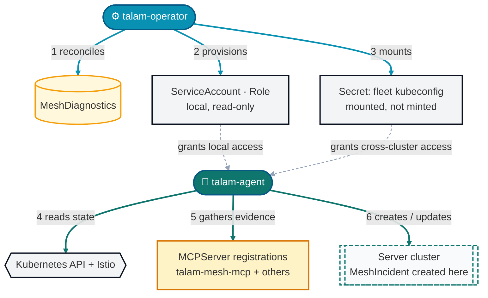
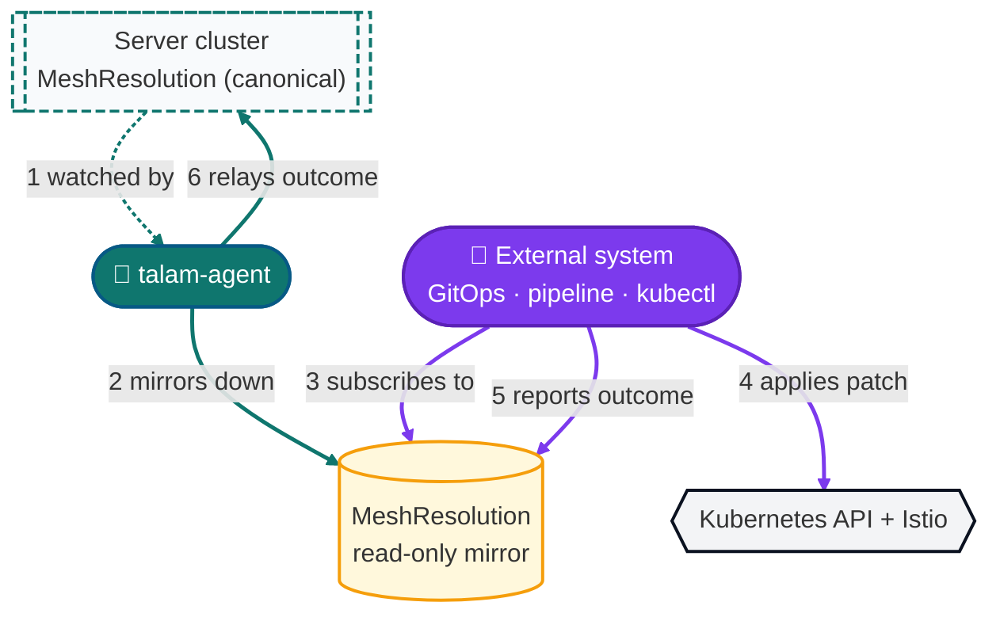
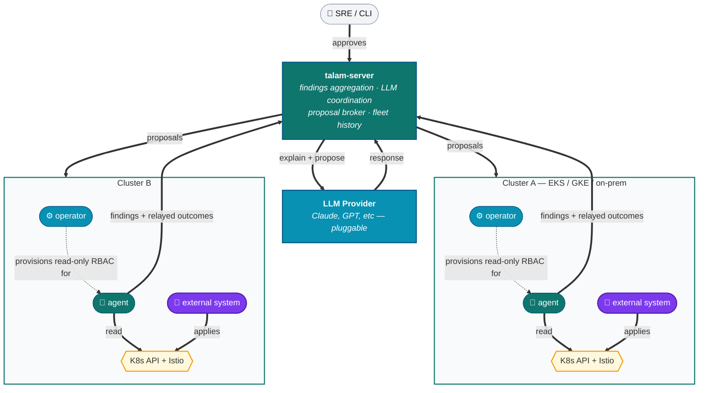

# Architecture overview

**Related:** reads [`0001`](../decisions/0001-server-agent-operator-split.md), [`0002`](../decisions/0002-deterministic-analyzers-then-llm.md), [`0003`](../decisions/0003-human-in-the-loop-remediation.md), [`0004`](../decisions/0004-mesh-agnostic-analyzer-interface.md), [`0007`](../decisions/0007-agent-never-applies-remediation.md), [`0008`](../decisions/0008-kubernetes-native-fleet-transport.md), [`0009`](../decisions/0009-agent-side-evidence-gathering-and-fleet-correlation.md); links out to every node under [`../components/`](../components/) and [`../concepts/`](../concepts/)

**Note:** the fleet-wide diagram and REST-call descriptions further below (`GET /v1/incidents`, `POST /v1/findings`, etc.) still describe the v0.1 transport, which [ADR-0008](../decisions/0008-kubernetes-native-fleet-transport.md) supersedes with cross-cluster Kubernetes watches. That diagram is pending an update; the single-cluster diagram immediately below is current.

talam reads Kubernetes and Istio API objects, runs deterministic analyzers against them, and hands the results to an LLM to explain in plain English — the same loop k8sgpt runs one layer down the stack. talam's failures live one layer up: not "pod won't schedule" but "pod is healthy, mesh routing is not."

## Design principles

1. **Deterministic first.** Every finding starts as a rule-based check against real API/xDS state ([ADR-0002](../decisions/0002-deterministic-analyzers-then-llm.md)). The LLM explains and proposes — it never originates a diagnosis.
2. **No blind writes.** talam never mutates cluster state at all — every proposed fix requires explicit human approval, then is applied by an external system talam only exposes it to, never by talam itself ([ADR-0003](../decisions/0003-human-in-the-loop-remediation.md), [ADR-0007](../decisions/0007-agent-never-applies-remediation.md)).
3. **Fleet-native.** One server, many clusters, many agents ([ADR-0001](../decisions/0001-server-agent-operator-split.md)). A mesh boundary spanning clusters is a first-class case.
4. **Mesh-agnostic core.** The analyzer interface doesn't know Istio exists ([ADR-0004](../decisions/0004-mesh-agnostic-analyzer-interface.md)).

## System topology

### Single-cluster view

Each mesh-bearing cluster runs one [operator](../components/operator/README.md) and one [agent](../components/agent/README.md). A single diagram trying to show setup, detection, *and* remediation together turned out to be the reason this section was hard to follow — split below into the two halves of the agent's job, each simple enough to read without a legend.

#### Detection: bootstrap through creating an incident

1. **Operator reconciles** `MeshDiagnostics` (which analyzers, scan interval, server endpoint, `fleetKubeconfigSecretRef`)
2. **Operator provisions** the agent's *local* ServiceAccount/Role — read-only on every mesh resource, full stop ([ADR-0007](../decisions/0007-agent-never-applies-remediation.md))
3. **Operator mounts** the pre-provisioned fleet-credential `Secret` into the agent's Deployment — it does **not** mint this credential, only plumbs it through ([ADR-0008](../decisions/0008-kubernetes-native-fleet-transport.md#credential-bootstrap))
4. **Agent reads** live local cluster state (API objects + Istio xDS) — read-only, same as everything else it touches outside its own writes
5. **Agent gathers evidence** from local `MCPServer` registrations (`talam-mesh-mcp` and others) while producing a finding — same-cluster only, no network exception needed ([ADR-0009](../decisions/0009-agent-side-evidence-gathering-and-fleet-correlation.md))
6. **Agent creates/updates `MeshIncident` directly in the server's cluster** — using the credential from step 3, the *only* cross-cluster write in this whole diagram

#### Remediation: from a proposal to a closed loop

1. **Agent watches** the canonical `MeshResolution` in the server's cluster, using the same cross-cluster credential from the detection diagram ([ADR-0008](../decisions/0008-kubernetes-native-fleet-transport.md))
2. **Agent mirrors** it down as a **read-only local copy** — this is what the external system actually subscribes to, so it never needs a cross-cluster credential of its own
3. **External system subscribes** to the local mirror — a GitOps controller, an existing config pipeline, or a human via `kubectl`; talam never assumes which
4. **External system applies** the patch on its own initiative and authority — talam-agent has no write RBAC on any mesh resource to do this itself ([ADR-0007](../decisions/0007-agent-never-applies-remediation.md))
5. **External system reports** the outcome by patching `status.conditions` on the local mirror — the readinessGate pattern ([ADR-0008](../decisions/0008-kubernetes-native-fleet-transport.md#the-object-model--zero-new-crd-types))
6. **Agent relays** that outcome back onto the canonical copy in the server's cluster, closing the loop

Cyan is the operator, teal the agent, violet the external system that actually applies remediation — the same two-arrow rule as before: no two components ever write to the same target. Local CRD state (`MeshDiagnostics`, the `MeshResolution` mirror) is queryable with `kubectl get` in the spoke cluster; `MeshIncident` and the canonical `MeshResolution` only exist in the server's cluster.

### Fleet-wide view

Agents from multiple clusters report findings to a central talam-server, which coordinates with an LLM provider:

**Key insight:** the server is the sole authority on *what* needs fixing (proposals flow server → agent, one direction only); each agent is the sole writer to *its own* cluster's talam CRDs, but reads (never writes) mesh resources directly ([ADR-0007](../decisions/0007-agent-never-applies-remediation.md)) — the external system in each cluster is the sole writer of mesh resources, and it's the agent that relays its outcome back to the server (findings + outcomes flow agent → server, the mirror of proposals). The two clusters never talk to each other, and an external system in cluster A never talks to cluster B — all coordination is brokered through the server, so there's exactly one path between any two components and no line has to guess which box it started from.

Component-level detail: [operator](../components/operator/README.md) · [agent](../components/agent/README.md) · [server](../components/server/README.md).

## LLM integration

The [server](../components/server/README.md)'s LLM gateway makes two calls per finding, never one, and both are schema-validated before storage — see [`../concepts/finding-and-incident.md`](../concepts/finding-and-incident.md) for the shapes involved:

1. **Explain** — evidence in, plain-language root cause out.
2. **Propose** — explanation in, a structured `RemediationProposal` out (patch, risk tier, resourceVersion pin). See [`../concepts/remediation-flow.md`](../concepts/remediation-flow.md) for what happens to a proposal next — including why talam itself never applies it ([ADR-0007](../decisions/0007-agent-never-applies-remediation.md)).

A malformed or hallucinated patch is rejected at the schema boundary and surfaced as "explanation only" rather than shown to a user.

## Roadmap

| Phase | Scope |
|---|---|
| **v0.1** | Single-cluster Istio, core analyzer catalog ([`../api/analyzer-catalog.md`](../api/analyzer-catalog.md)), manual-approval remediation talam only proposes and exposes, never applies ([ADR-0003](../decisions/0003-human-in-the-loop-remediation.md), [ADR-0007](../decisions/0007-agent-never-applies-remediation.md)) |
| **v0.2** | Multi-cluster correlation into incidents, web dashboard, richer xDS-drift analyzers |
| **v0.3** | Policy-gated auto-approval for allowlisted low-risk classes (still handed off, never applied by talam); GitOps-native mode (proposals rendered as PRs against the repo an external controller already reconciles from) |
| **v0.4** | Linkerd analyzer set behind the existing interface ([ADR-0004](../decisions/0004-mesh-agnostic-analyzer-interface.md)); ambient/sidecar-less (Cilium) support with new eBPF-aware collectors |

See [`../roadmap.md`](../roadmap.md) for the fuller breakdown.

## See also

- Full visual version of this document: [talam Architecture artifact](https://claude.ai/code/artifact/7038ccdf-cd29-4692-bba9-e3cd1add674f)
