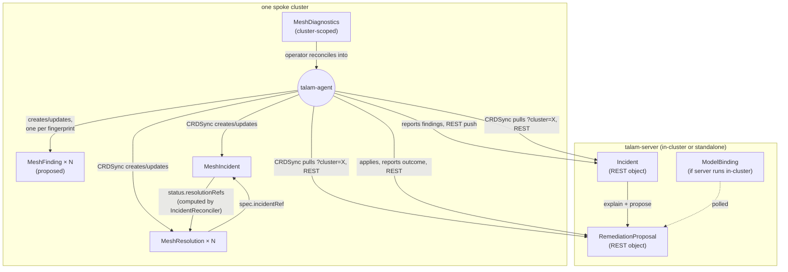

# Object model

**Related:** reads [`ADR-0001`](../decisions/0001-server-agent-operator-split.md), [`ADR-0005`](../decisions/0005-crd-native-incidents-and-resolutions.md), [`finding-and-incident.md`](finding-and-incident.md), [`remediation-flow.md`](remediation-flow.md); read by [`../api/crds.md`](../api/crds.md), [`../components/agent/README.md`](../components/agent/README.md), [`../components/server/README.md`](../components/server/README.md)

talam's operating principle: **every piece of state that matters is a Kubernetes object, and every action is a controller reacting to one.** Not a REST call that happens to also update a store, not a message on a queue — an object with a `spec` (desired/observed state) and a `status` (what happened), sitting in etcd, watchable with `kubectl get`, diffable, and reconcilable by exactly one owner. This doc is the map of that object graph: every object, what owns it, what references what, and — for the one place the model isn't fully closed yet — what's proposed to finish it.

This isn't a from-scratch design; it's the pattern [ADR-0005](../decisions/0005-crd-native-incidents-and-resolutions.md) established for incidents and remediation, generalized. Read that ADR first if you haven't — the constraint it exists to satisfy (talam-server never gets Kubernetes credentials into a spoke cluster, full stop) is why the object model has the shape it has, not a REST-first shape with objects bolted on.

## The tagging principle

"Which agent should act on this?" is answered by **where the object lives**, not by a label an agent has to filter on. Each cluster's agent is deployed by that cluster's operator, watching only that cluster's API server — an object created in cluster A's etcd is physically invisible to cluster B's agent. `MeshDiagnostics.spec.clusterName` (reconciled by the operator into the agent's `-cluster` flag) is what names the tag; the cluster boundary is what enforces it. No object in this model needs a `talam.dev/assigned-agent` label, because there's structurally only one agent that could ever see it.

The one place this genuinely widens is [ADR-0004](../decisions/0004-mesh-agnostic-analyzer-interface.md)'s multi-backend future (Linkerd, Cilium-ambient) *if* it ever means more than one agent process sharing one cluster (e.g. one per mesh backend). That's not built and not needed yet — v0.1 is one agent per cluster — but if it happens, a `talam.dev/backend: istio` label on `MeshDiagnostics` and a matching selector on the agent's watch is the natural extension, not a redesign.

## Objects, at a glance

| Object | Scope | Owner (writer) | Created by | Consumed by |
|---|---|---|---|---|
| [`MeshDiagnostics`](#meshdiagnostics) | Cluster | Human (or GitOps) | — | [Operator](../components/operator/README.md) |
| [`MeshFinding`](#meshfinding-proposed) *(proposed)* | Namespace | Agent | Agent's analyzer engine, per scan tick | Agent's own Reporter; `kubectl` |
| [`MeshIncident`](#meshincident) | Namespace | Agent | Agent's [CRDSync](../components/agent/README.md), from talam-server | Agent's IncidentReconciler; `kubectl`; dashboard (via server, not the CR) |
| [`MeshResolution`](#meshresolution) | Namespace | Agent | Agent's CRDSync, from talam-server | Agent's ResolutionReconciler; `kubectl` |
| [`ModelBinding`](#modelbinding) | Namespace | Human (or GitOps) | — | talam-server's LLM gateway |

Everything below "Namespace" scope lives in the same namespace an agent's Deployment does (`talam-system` by default) — there's exactly one tenant per cluster in v0.1, so namespacing these mainly buys clean `kubectl` ergonomics and RBAC scoping, not multi-tenancy.



The two REST arrows crossing the cluster boundary are the *only* non-object interaction in the whole system, and they exist for exactly one reason: talam-server has no credentials into the spoke cluster, so it cannot watch or write an object there even if we wanted it to. Everything on the spoke side of that boundary — detection, correlation status, remediation triggering, remediation outcome — is an object a controller reconciles.

## Object reference

### MeshDiagnostics

Cluster-scoped. The operator's only input; see [`../api/crds.md#meshdiagnostics`](../api/crds.md#meshdiagnostics) for the full schema. Relevant here only for what it *tags*: `spec.clusterName` is the value every `MeshFinding`/`MeshIncident`/`MeshResolution` this cluster's agent creates is implicitly scoped to (by living in this cluster at all), and `spec.serverEndpoint` is where the agent's Reporter and CRDSync both point.

### MeshFinding (proposed)

**Not implemented yet** — the gap this doc exists partly to name. Today, [`Finding`](finding-and-incident.md#finding) data only exists as: (a) an in-memory Go value inside the agent's scan loop, (b) a REST payload the Reporter pushes to talam-server, and (c) denormalized copies embedded in `MeshIncident.spec.findings` once talam-server's correlation and the Sync loop round-trip it back. There is no object a human or a local controller can watch that says "here's what this agent currently sees wrong," independent of talam-server being reachable — which is exactly the property `MeshFinding` was supposed to provide (it's been in [`../api/crds.md`](../api/crds.md) since before any code existed).

Proposed spec:

```go
type MeshFindingSpec struct {
    AnalyzerID  string
    Severity    Severity
    Resource    ResourceRef
    RelatedRefs []ResourceRef
    RawEvidence map[string]any
    DetectedAt  metav1.Time
}
type MeshFindingStatus struct {
    // Empty in v0.1 — a Finding doesn't have its own lifecycle distinct from
    // existing or not. Reserved for a future per-finding LLM explanation
    // that doesn't require correlation into an Incident first.
}
```

Owned and created entirely by the agent's analyzer engine, one object per `Finding.Fingerprint()` (the same fingerprint `internal/server/store.go` already uses), upserted every scan tick, never touching talam-server to exist. The Reporter keeps pushing to talam-server exactly as it does today — `MeshFinding` doesn't replace that transport, it just means the same data is *also* a local object, so `kubectl get meshfindings` works with the cluster fully network-partitioned from talam-server. `MeshIncident.spec.findings` would then plausibly shift from an embedded copy to a `[]LocalObjectReference` into `MeshFinding` objects, removing the one place data is currently duplicated across two objects — a normalization cleanup, not a behavior change.

This is real, scoped, buildable work (analyzer-engine change, RBAC grant, CRD YAML, tests, live validation) — flagging it here rather than building it unprompted; say the word and it's the natural next PR.

### MeshIncident

Namespaced. Full schema and example: [`../api/crds.md#meshincident--meshresolution`](../api/crds.md#meshincident--meshresolution). Agent-owned per [ADR-0005](../decisions/0005-crd-native-incidents-and-resolutions.md): `spec` (fingerprint, findings, firstSeen) and `status.{state,lastSeen,explanation,explainError}` are synced from talam-server's `Incident`; `status.{resolutionRefs,complete}` are computed entirely locally by `IncidentReconciler` from `MeshResolution` objects referencing it — no server round-trip for that half.

### MeshResolution

Namespaced. Full schema: [`../api/crds.md#meshincident--meshresolution`](../api/crds.md#meshincident--meshresolution). The CRD realization of `RemediationProposal`. `spec.triggered` is the one field a human authorizes (via the dashboard → talam-server → next Sync tick, or a direct `kubectl patch` as an escape hatch) — never set by talam-server or any reconciler. `status.phase` mirrors the server until `status.performed` goes true, at which point `ResolutionReconciler` owns status exclusively; `status.outcomeReported` tracks whether talam-server has acknowledged the result independently of whether the apply itself succeeded, so a network blip reporting the outcome gets retried without ever risking a second apply.

### ModelBinding

Namespaced. Full schema: [`../api/crds.md#modelbinding`](../api/crds.md#modelbinding). The odd one out in this table — it's *server*-owned (talam-server polls and reads it, never the agent), and it only exists at all when talam-server runs in-cluster. Included here because it's still the same principle: which LLM backs the fleet is an object, not an environment variable, and changing it is `kubectl apply`, not a restart.

## Walking one incident end to end

1. Agent's analyzer engine finds an orphaned `DestinationRule` subset. *(Proposed: upserts a `MeshFinding`.)* Reporter pushes it to talam-server.
2. talam-server correlates by fingerprint into an `Incident`, calls the LLM gateway (explain, then propose), stores the result.
3. Agent's `CRDSync` pulls `?cluster=X`, creates a `MeshIncident` (spec = findings, status = explanation) and a `MeshResolution` (spec.triggered = false).
4. A human reads the explanation and patch in the dashboard, clicks Approve. talam-server's REST store flips the proposal to `Approved`.
5. Next `CRDSync` tick: `MeshResolution.spec.triggered` becomes `true`.
6. `ResolutionReconciler` sees `triggered && !performed`, dry-runs, applies (resourceVersion-gated — see the applier hardening from the earlier review round), writes `status.phase=Applied`, `status.performed=true`, and reports the outcome back to talam-server, retrying independently via `status.outcomeReported` if that report fails.
7. `IncidentReconciler` sees the referenced `MeshResolution` performed, sets `MeshIncident.status.complete = true`.
8. Next scan: the orphaned subset is gone, the finding clears, talam-server marks the `Incident` `Resolved` — independently computing the same `Complete` value the CR already has, so `kubectl` and the dashboard never disagree.

Every step past #2 is an object write a controller made in reaction to another object changing. Step 2 and the two REST legs of #3/#6 are the only places this crosses the trust boundary ADR-0001 draws — and they're pull/push REST calls specifically *because* an object can't be watched across a boundary neither side has credentials to cross.
